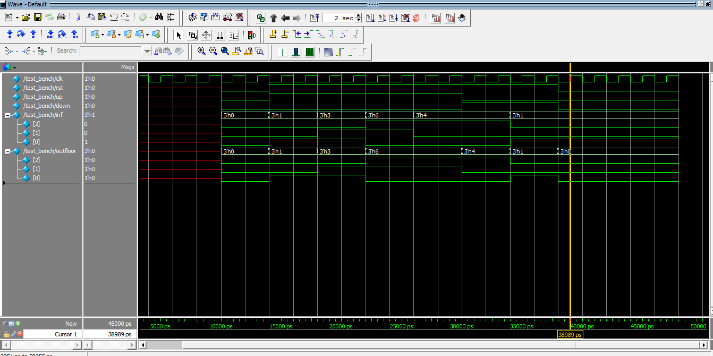

# Design and Simulation of Elevator Model using Verilog HDL 

## Introduction 
Elevators are widely used in shopping malls, airports, offices, hotels, hospitals and flats. Due to increasing population, architect are building tall buildings to entertain increasing demands in lesser ground area. Along with that, handicap person is helpless to use stairs. So, elevator plays a key role in our daily life to move towards any floor within short period of time.

## Working
Elevator is designed for seven floor building. Its interface is user friendly in terms of inputsto elvator. It is designed and tested using **ModelSim** Software. Since code here is only for simulation because scripts were customized according to boards constraints. It was later tested on **Spartan 3E Kit**.

There are three main inputs that user will be requested to enter:
1. **Up:** shows that user wants to go upward.
2. **Down:** shows that user wants to move down.  
3. **INF:** is used to request floor to be entered.
4. **OUTFLOOR** is output signal to show the position of elevator.

Other inputs include `clk` and `rst` signals which are obvious in any sequential circuit.

## Simulation Graph

#### Note
This code was designed during my bachelors studies in 2016. Since it is not efficent but a litte effort to explore the Hardware Descripive Language.

Thank you for reading :smiley:.
